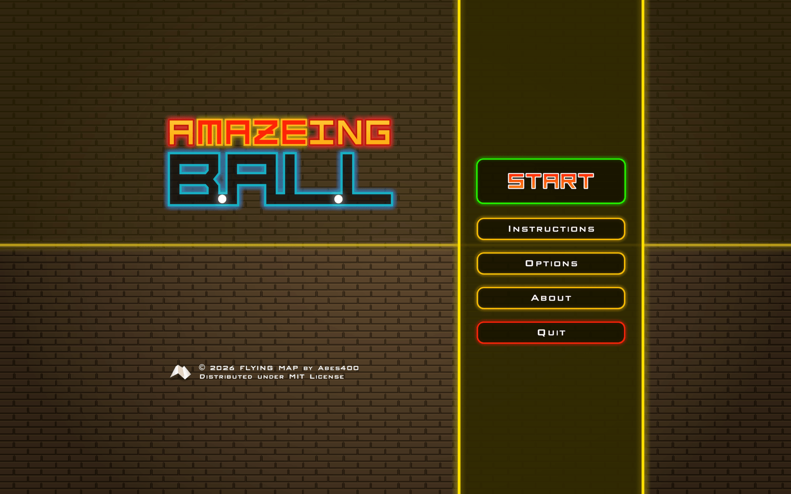
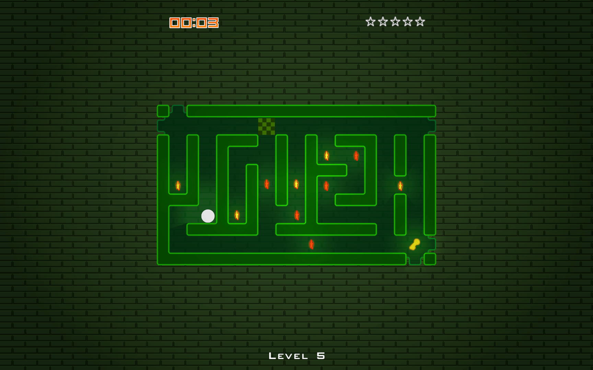
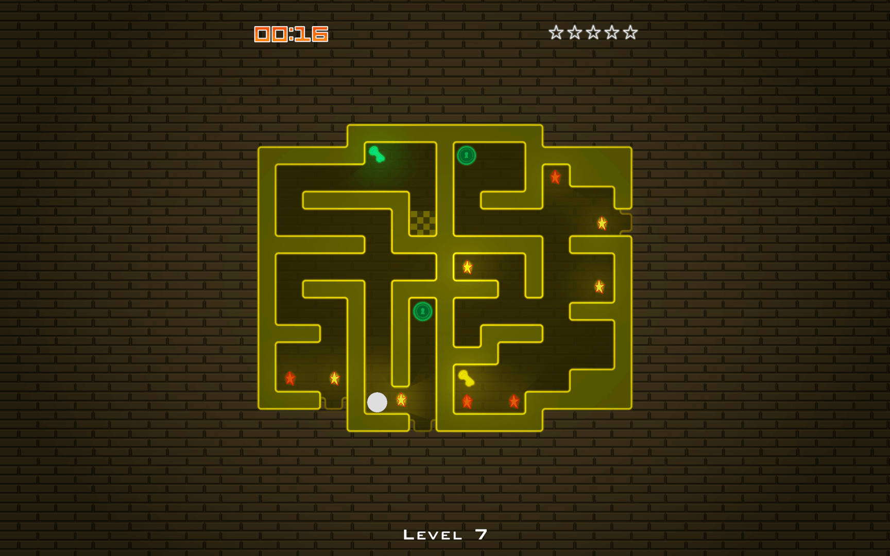
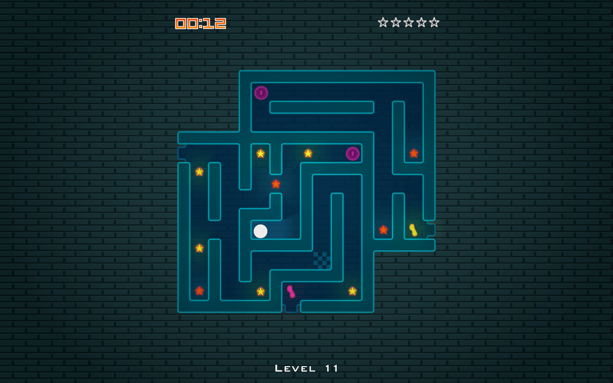

<b>A simple strategy game where the player guides a ball through a rotatable maze.</b>

Made with Unity&#174;.\
Distributed under MIT License.

**[Jump to Build Instructions](#build-instructions)**  
**[Jump to Building Installers](#building-installers)**

<hr>

| | |
| - | - |
|||
|||

<hr>

## About the Game
Guide the ball to the finish points in different mazes as fast as possible. Collect as many stars as you can. Complete all the levels to beat the game.


### Controls
- **Arrow keys:** Rotate the maze
- **Esc:** Pause/Resume
- **R:** Restart the level
- **Mouse:** Navigation through the menus


<br>

## Credits
- Artwork, Programming, and Level Design - **Abes400**
- Concept based on **Gravity Ball&trade;** by **LG R&D Lab, Russia**.
- Sound effects obtained from **[Zapsplat](https://www.zapsplat.com)**.

<br>

## Build Instructions
**NOTE**: From now on, the toppermost directory of this repository will be referred to as the ***Repo Directory***. As you clone this repository, this directory will probably be named as **a-maze-ing-ball-game**. The sub contents of **Repo Directory** should be as follows:

```
Repo_Directory\
├─ A-Maze-Ing Ball\
├─ Repo_Assets\
├─ .gitignore
├─ LICENSE
├─ Makefile
└─ README.md
```

**NOTE**: It is **highly** recommended to save the **built application folder/bundle** on a directory named `abl_dist`, created in `Repo_Directory`. The installer building scripts will highly rely on it. After building, the directory tree should be as follows:

```
Repo_Directory\
├─ A-Maze-Ing Ball\
├─ abl_dist\
│   ├─ Amazeing Ball.app\ (If built for Mac)
│   └─ Amazeing Ball\ (Contains the Windows .exe)
├─ Repo_Assets\
├─ .gitignore
├─ LICENSE
├─ Makefile
└─ README.md
```
## Building Installers
### Windows (x64)
- #### Prerequisites for Windows
    - **NullSoft Scriptable Install System (NSIS)** -- *[Download From Here](https://nsis.sourceforge.io/Download)*

- #### Building Installer for Windows
    - Open **NSIS**
    - Select **Compile NSI scripts**
    - Drag & drop the **[Windows Installer Script](./Repo_Assets/win_wiz/windows_installer.nsi)** to the ***MakeNSISW*** window.
    - On success, you should see the ***Installer executable*** at `Repo_Directory\abl_dist\`.

<br>

### macOS (Universal)
- #### Prerequisites for macOS
    - **create-dmg Command Line Tool**  -- *Run `brew install create-dmg` on **Terminal** if not installed (Homebrew required)*

- #### Building Installer for macOS
    On Terminal:
    ```
    # Go to the Repo Directory
    cd /path/to/the/Repo_Directory

    # If you have 'Make' installed:
    make dmg

    # If you don't have 'Make' installed:
    create-dmg \
    --volname "Install Amazeing Ball 1.0" \
    --volicon "Repo_Assets/mac_dmg/install_mac.icns" \
    --background "Repo_Assets/mac_dmg/dmgbg.png" \
    --window-pos 200 120 \
    --window-size 540 380 \
    --icon-size 80 \
    --icon "Amazeing Ball.app" 150 250 \
    --hide-extension "Amazeing Ball.app" \
    --app-drop-link 380 250 \
    "./abl_dist/Install_Amazeing_Ball_1.0.dmg" \
    "./abl_dist/Amazeing Ball.app"
    ```
    On success, you should see the **Installer Disk Image** at `Repo_Directory/abl_dist/`.

<br>
